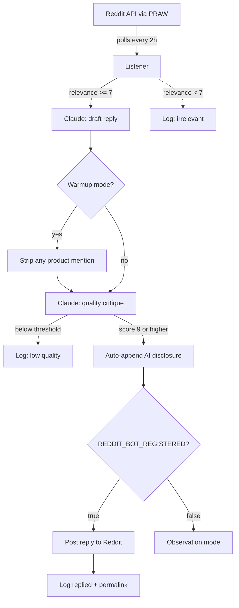

# AgentFetch — Reddit Listener (public reference)

This repo is the Reddit-facing module of a larger autonomous sales/marketing
system (salesbot). It is shared publicly for the Reddit API team's review of
the Listener's behavior. The rest of salesbot is unrelated to Reddit (Stripe
webhooks, SendGrid email, Twitter posting) and lives in a private repo.

> **Note for Reddit reviewers:** This code is provided in good faith for
> review of the API Access Request. The bot itself does not run yet — it
> ships with `REDDIT_BOT_REGISTERED = False` (a hard kill switch), which
> means even after deploy it only drafts and logs; it cannot post until
> the operator explicitly flips that flag after Reddit's approval.

## Purpose

The Listener helps Redditors building MCP servers, AI agents, and LLM apps
by drafting short, helpful technical replies to questions in target
subreddits: r/ClaudeAI, r/mcp, r/LocalLLaMA, r/LangChain, r/AI_Agents,
r/LLMDevs.

Replies are AI-drafted by Claude, posted autonomously, and **always
disclose** their AI nature via an auto-appended footer.

## Architecture

## Safeguards

1. **Hard rate limits** — max 2 replies/day total across all subs in warmup,
   max 5/day in steady state. Max 1 reply per subreddit per day in warmup.
2. **Relevance triage** — first Claude pass scores 0–10; only posts at >=7
   reach the draft step. ~95% of scanned posts are filtered out here.
3. **Self-critique gate** — separate Claude pass scores each draft 0–10 on
   community-tone quality. Only posts at >=9 (>=9.5 in warmup) are sent.
4. **AI-disclosure footer** — auto-appended to every reply before posting,
   in code, non-optional. The text is configurable but cannot be omitted.
5. **REDDIT_BOT_REGISTERED kill switch** — Listener boots in observation
   mode (drafts + logs but does not post) until the operator explicitly
   flips this flag. Posting cannot accidentally start.
6. **Single-purpose account** — the bot account never posts manually.
   No mixed use, per the Responsible Builder Policy.
7. **Read-only, low volume** — ~120 read requests/day, <=2 write/day.
   No upvotes, no DMs, no top-level submissions, no user data scraping.
8. **Dedup via DB** — every thread we consider is logged with the decision;
   the bot never replies to the same thread twice.

## What it doesn't do

- Vote on posts or comments (not even silently)
- Send direct messages
- Post top-level submissions
- Scrape user profiles or follow user activity
- Train any ML model on Reddit data
- Maintain any user-level dataset (we store thread IDs and our own draft
  text only — not other users' content beyond what the bot replies to)

## Tested

Covered by a 27-test pytest suite in the parent salesbot repo. Tests verify
the warmup-mode product-mention guard, the disclosure-footer auto-append,
the rate-limit math, and the REDDIT_BOT_REGISTERED gate.

## Files

- [`community_listener.py`](./community_listener.py) — main agent
- [`reddit_client.py`](./reddit_client.py) — PRAW wrapper, async-from-sync
- [`config_excerpt.py`](./config_excerpt.py) — Listener-relevant settings

## Contact

Brett Halverson · [agentfetch.dev](https://agentfetch.dev) ·
[github.com/bch1212/agentfetch-mcp](https://github.com/bch1212/agentfetch-mcp)

## License

MIT
